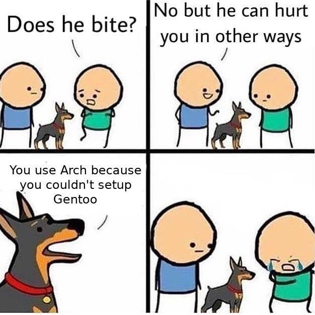

# archinstall
Just a bare bone automated [Arch](https://wiki.archlinux.org/index.php/Arch_Linux) install with network deployment instructions based on MAC-address.

Pre-built ISO's can be found here: https://hvornum.se/archiso/

# Install a basic Arch Linux
In a live-cd environment, do:

    # wget https://raw.githubusercontent.com/Torxed/archinstall/master/archinstall.py
    # python3 archinstall.py --default

> **CAUTION**: If no **other** parameters are given, **it will devour the first disk in your system** (Usually `/dev/sda`, `/dev/nvme0n1` etc).

This will install a basic Arch Linux, without interaction, on the first drive it finds. Use `--drive=/dev/sdb` etc to change the desired destination, or skip `--default` if you want to get options for your installation.

> NOTE: This assumes Python is installed on your ISO, follow [ArchISO](https://wiki.archlinux.org/index.php/archiso)'s guide on how to create your own ISO or use a pre-built [guided ISO](https://hvornum.se/archiso/). Below is examples and a cheat sheet to set up and auto-run this on a ISO.

# Autorun on Arch Live CD (Unattended install)

We'll need to reconfigure the live ISO medium to include Python etc. 
To do so, we need to add some packages to `packages.x86_64` and add some commands to `customize_airootfs.sh`.

    # cd ~/archlive
    # echo -e "git\npython\npython-psutil" >> packages.x86_64
    # cat <<EOF >> ./airootfs/root/customize_airootfs.sh
    cd /root
    git clone https://github.com/Torxed/archinstall.git
    chmod +x ~/archinstall/archinstall.py
    EOF
    # mkdir ./airootfs/etc/skel
    # echo '[[ -z $DISPLAY && $XDG_VTNR -eq 1 ]] && sh -c "~/archinstall/archinstall.py --default"' >> ./airootfs/etc/skel/.zprofile

> Note: `~/archlive` might be different on your system, see [ArchISO#Setup](https://wiki.archlinux.org/index.php/archiso#Setup) for more info.

After all those commands are done, you can go ahead and run:

    # rm -v work*; ./build.sh -v

Whenever this live-cd boots, from here on now - it'll run `archinstall.py` and attempt to unattendely install a default Arch Linux base OS with `base base-devel` as packages.
Or - if successfull - a MAC-address matches a profile at [/deployments](https://github.com/Torxed/archinstall/tree/master/deployments) for the machine to be installed.

> **CAUTION**: If no parameters are given, **it will devour the first disk in your system** (Usually `/dev/sda`, `/dev/nvme0n1` etc).

## Unattended profile install

Everything in the steps above are the same, except for one line that needs to change to look like this:

    # echo '[[ -z $DISPLAY && $XDG_VTNR -eq 1 ]] && sh -c "~/archinstall/archinstall.py --profile=workstation"' >> ./airootfs/etc/skel/.zprofile

This will unattendely install the [workstation](https://github.com/Torxed/archinstall/blob/master/deployments/workstation.json) profile.

## User guided installation (DEFAULT)

Change the autostart line to match:

    # echo '[[ -z $DISPLAY && $XDG_VTNR -eq 1 ]] && sh -c "~/archinstall/archinstall.py"' >> ./airootfs/etc/skel/.zprofile

This will cause the script to halt and ask for a profile to install before proceeding.
When asked, enter `workstation` for instance - to install based on the [workstation](https://github.com/Torxed/archinstall/blob/master/deployments/workstation.json) template.

> **CAUTION**: If a MAC-address matches under `/deployments`, that profile will forcefully be installed and have presidence over any other profile information.

## With custom webserver for deployment profiles

Again, one line differs from the other install methods, change the following line:

    # echo '[[ -z $DISPLAY && $XDG_VTNR -eq 1 ]] && sh -c "~/archinstall/archinstall.py --profiles-path=http://example.com/profiles"' >> ./airootfs/etc/skel/.zprofile

This will cause the script to look at `http://example.com/profiles/<profile>.json` for instructions.

# Rerunning a installation

    # umount -R /mnt; cryptsetup close /dev/mapper/luksdev
    # python3 ./archinstall/archinstall.py
    
> Note: This assumes `--post=stay` is set to avoid instant reboot at the end or if during any time a user pressed `Ctrl-C` and aborted the installation.

# Some parameters you can give it

    --drive=</dev/sdX>
      Which drive to install arch on, if absent, the first disk under /dev/ is used
    
    --size=100% (Default)
      Sets the size of the root filesystem (btrfs)
    
    --start=513MiB (Default)
      Sets the starting location of the root partition
      (TODO: /boot will take up space from 1MiB - <start>, make sure boot is no larger than 513MiB)
    
    --password=0000 (Default)
      Which disk password to use,
        --password="<STDIN>" for prompt of password
        --password="<YUBIKEY>" for setting a unique password on the YubiKey and use that as a password
        (NOTE: This will wipe/replace slot 1 on the YubiKey)

    --pwfile=/tmp/diskpw (Default)
      Which file to store the disk encryption password while sending it to cryptsetup
    
    --hostname=Arcinstall (Default)
      Sets the hostname of the box
    
    --country=SE (Default)
      Default mirror allocation for fetching packages.
    
    --packages='' (Default)
      Which additional packages to install, defaults to none.
      (Space separated as it's passed unchanged to `pacstrap`
    
    --user=<name>
      Adds an additional username to the system (default group Wheel)
    
    --post=reboot (Default)
      After a successful install, reboots into the system. Use --post=stay to not reboot.

    --default
      This parameter causes the installation script to install arch unattended on the first disk

    --profile=<name>
      For instance, --profile=workstation will install the workstation profile.

    --profiles-path=https://example.com/profiles
      Changes the default path the script looks for deployment profiles.
      The default path is 'https://raw.githubusercontent.com/Torxed/archinstall/master/deployments'

Deployment profile structs support all the above parameters and more, for instance, custom arguments with string formatting.
See [deployments/workstation.json](https://github.com/Torxed/archinstall/blob/net-deploy/deployments/workstation.json) for examples.

## End note

 
